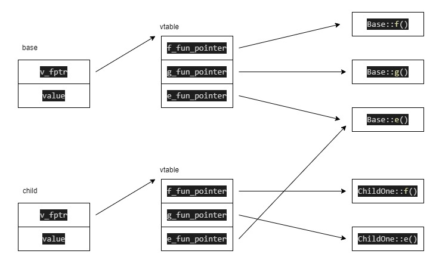

# cxx-vtable

## c++内存模型说明



注意：虚函数表是在编译期生成的


## 部分代码解析

```c++
// 这里的指针操作比较混乱，在此解析下:
// 1. p 指向对象的首地址，根据c++内存模型，此时p也指向虚表指针
// 2. *(int64_t *)p，得到虚函数表的起始地址
// 3. (int64_t *)*(int64_t *)p，将当前指针转为数组指针，每个元素大小为8字节
// 4. *(int64_t *)*(int64_t *)p，得到数组第一个元素
// 5. *((int64_t *)*(int64_t *)p + 1))，得到数组第二个元素
printf("虚表地址:%p\n", *(int64_t *)p);
printf("第一个虚函数地址:%p\n", *(int64_t *)*(int64_t *)p);
printf("第二个虚函数地址:%p\n", *((int64_t *)*(int64_t *)p + 1));

// 6. (Fun)*((int64_t *)*(int64_t *)p)，将虚函数表第一个函数地址转换为函数指针
// 7. pfun，执行该函数
pfun = (Fun)*((int64_t *)*(int64_t *)p);  //vitural f();
printf("f():%p\n", pfun);
pfun();

// 8. (Fun)(*((int64_t *)*(int64_t *)p + 1))，将虚函数表第一个函数地址转换为函数指针
// 9. pfun，执行该函数
pfun = (Fun)(*((int64_t *)*(int64_t *)p + 1));  //vitural g();
printf("g():%p\n", pfun);
pfun();
```


## 结果

```c++
--------------- base class vtable -----------------
虚表地址:0x55d747337d38
第一个虚函数地址:0x55d747136eae
第二个虚函数地址:0x55d747136ee6
第三个虚函数地址:0x55d747136f1e
f():0x55d747136eae
Base::f
g():0x55d747136ee6
Base::g
e():0x55d747136f1e
Base::e
--------------- derived class vtable -----------------
虚表地址:0x55d747337d10
第一个虚函数地址:0x55d747136f56
第二个虚函数地址:0x55d747136f8e
第三个虚函数地址:0x55d747136f1e
f():0x55d747136f56
ChildOne::f
g():0x55d747136f8e
ChildOne::g
e():0x55d747136f1e
Base::e
```


